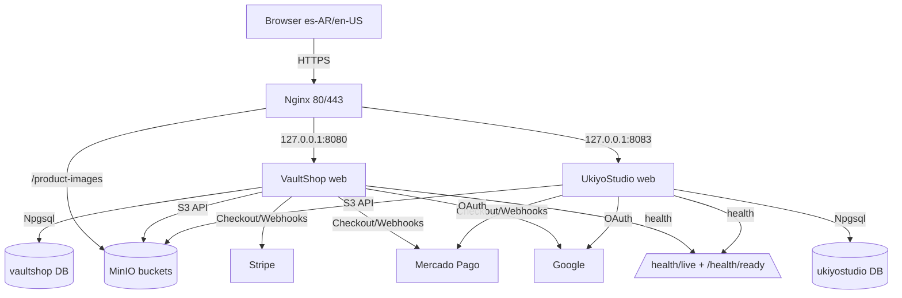

# VaultShop Architecture

VaultShop is a self-hosted ASP.NET Core 8 MVC monolith on Ubuntu 24.04 VPS: one web app, one PostgreSQL 16, one MinIO S3, Nginx HTTPS proxy. Two stores (VaultShop + UkiyoStudio) share the platform but are fully isolated per DB/bucket/creds.

## Deployment Boundaries
- Public only: Nginx 80/443; PG + MinIO private (MinIO API `127.0.0.1:9000` via `/product-images` proxy)
- SSH: Tailscale; `COMPOSE_PROJECT_NAME` stable (`vaultshop-platform`/`vaultshop`/`ukiyostudio`)
- Platform compose (`postgres`, `minio`, volumes, network) + per-store compose (`web` only, loopback port, DP keys)
- Per-store isolation: separate DB + role (cross-DB denied), separate bucket + scoped MinIO user (cross-bucket denied), separate backups

## Application Boundaries
- Images via `IImageStorageService`; `ProductImage.ObjectKey` = storage identity, `ImageUrl` = display URL
- Checkout transactional (`CheckoutService.ExecuteInTransaction`); pagination `PagedList<T>` 12/page; billing QuestPDF from snapshot
- Payments: keyed `IPaymentSessionService`/`IPaymentRefundService` by `SD.PaymentMethod*`; signed webhooks + server-side lookup drive status, browser return only verifies; refund on cancel
- Hardening: `ForwardedHeaders` (OAuth behind proxy), `AddRateLimiter` (Global + Login per-IP 429), `Identity Lockout`, `UseStatusCodePagesWithReExecute` (branded 404/500), `AddHealthChecks` (DB + `StorageHealthCheck`) → `/health/live` (200) / `/health/ready` (200/503)
- Config-driven branding/theme (`Branding__*`, `Theme__*` hex → CSS vars), l10n `es-AR`/`en-US`, `Database__RunMigrationsOnStartup=false` in prod

## Future Client Deployment
Reuse same codebase shape, new per-store env + compose project + domain + DB/bucket/creds + Stripe/MP secrets + backups/cron. For full VM/K8s isolation, skip shared platform.
